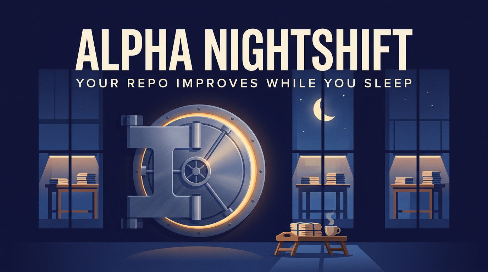
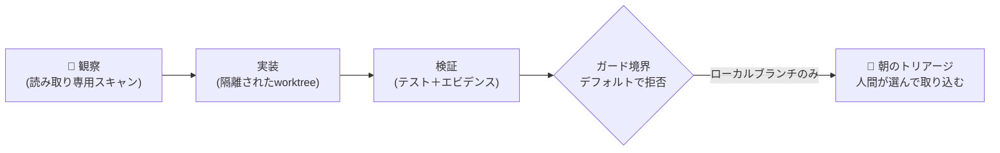

# alpha-nightshift

<div align="center">

[🇺🇸 English](README.md) ｜ **🇯🇵 日本語** ｜ [🇨🇳 简体中文](README.zh.md) ｜ [🇹🇭 ไทย](README.th.md)



<h4>夜間にAIエージェントがリポジトリで作業できるようにする夜間メンテナンスループ——本物のリモートにはプッシュできない境界の内側にロックされている。</h4>

[](https://github.com/caty-ai/alpha-nightshift/actions/workflows/ci.yml)
[](LICENSE)

%20%7C%20Linux%20(CI)-lightgrey)

[できること](#what) ｜ [必要なもの](#requirements) ｜ [はじめかた](#start) ｜ [安全な理由](#safety) ｜ [もっと知る](#more)

あなたが眠っている間、観察と修復のレーンは隔離されたworktree内で実行されます。<br>
朝になったら、短いレポートを確認し、実証されたものだけを選んで取り込みます。

**夜は働く。決めるのはあなた。**

🔧 [エンジニアリングドキュメント](docs/engineering.md) ｜ 📘 [詳細リファレンス](docs/reference.md)

</div>
<!-- repo-state:begin (generated; do not edit) -->
<p align="center"><sub>generation: <code>894501c</code> (2026-08-27T02:46:47Z) · verify: <a href="https://api.github.com/repos/caty-ai/alpha-nightshift/commits/main">API HEAD</a> · <a href="./status.json">status.json</a></sub></p>
<!-- repo-state:end -->

---

<a id="familiar"></a>

## 心当たりはありませんか？

以下のどれかに心当たりがあるなら、このループはまさにその悩みのために作られました。

- AIエージェントはあなたがキーボードの前にいる間しか作業が進まず、夜間は完全に停止している
- 一度エージェントを無人のまま動かしてみたら、何をプッシュしてしまうか気になって一晩中不安だった
- 小さなメンテナンス作業（不安定なテスト、lintの負債、ドキュメントのズレ）が、日中は機能開発に追われて溜まっていく
- 「自律的」であってほしいのに、それを謳うツールはどれも「とにかく信用してほしい」としか言ってこない

alpha-nightshiftは、その積み残しのための夜勤です——信用ではなく、鍵の下で動きます。

---

<a id="what"></a>

## できること

夜間、このループはリポジトリを観察し、小さなメンテナンスレーンで作業を行い、自分自身の結果を検証します——すべてはmainブランチに一切触れない、隔離されたgit worktreeの中で行われます。朝になると、トリアージレポートが手渡され、あなたはそこから価値を証明したものだけを選んで取り込みます。



- 🌙 **眠っている間も働く**

  スケジュールされたレーン（launchd経由）がgit worktree内で観察・実装・検証を行います——1レーンにつき1ブランチ、mainでは絶対に作業しません。

- 🔒 **本物のリモートにはプッシュできない**

  パブリッシャーは型付きゲートウェイの奥に置かれており、リモートの安全性が証明されるまで、そのpreflightは常に`write_mode:false`を返します。拒否は設定オプションではなく、デフォルトの状態です。

- 🔍 **生成したものすべてをスキャンする**

  バージョン固定された`gitleaks`バイナリ（実行のたびにハッシュ検証される）が候補オブジェクトを検査し、バイナリ、アーカイブ、未知のファイル形式はすべて即座に拒否されます。

- 🌅 **毎朝あなたに報告する**

  トリアージテンプレートが、夜間の調査結果をコーヒーを飲みながら判断できる採用／却下の意思決定に変換します。

- 🧭 **公開リポジトリ間の足並みを揃える**

  読み取り専用のorg-consistencyレーンが、ファミリーマップ、公開README、エージェント手順のズレを見つけ、対応の判断はすべて日中のレビューに残します。

---

<a id="requirements"></a>

## 必要なもの

ループ自体はMac上で動作します。その挙動を証明するテストスイートはLinux上でも実行されます。

| 項目 | 対応状況 |
|---|---|
| macOS (Apple Silicon) | ✅ 主要ターゲット——サンドボックスプロファイルとlaunchdスケジューリングはmacOSネイティブ |
| Linux | ✅ CI（Ubuntu）でテストスイートを実行——移植可能なスイートはすべてのプルリクエストで検証 |
| ランタイム | ✅ bash 3.2+（macOSシステムbash）、公開ゲート用にPython 3.9+、`jq` |
| AIエージェント | ✅ エージェント非依存——レーンは設定した任意のCLIエージェントを動かせます |

---

<a id="start"></a>

## はじめかた

始め方は2通り——エージェントにやらせるか、自分でやるかです。

### AIエージェントに頼む

以下をClaude Code、Codex CLI、その他任意のコーディングエージェントに貼り付けてください:

```
Clone https://github.com/caty-ai/alpha-nightshift and run `make test`.
Then read docs/engineering.md and tell me how the guard boundary works.
```

### 自分でやる

```sh
git clone https://github.com/caty-ai/alpha-nightshift.git
cd alpha-nightshift
make test
```

`make test`は検出されたスイート数を`tests/expected_suite_count`と照合し、実行環境の契約が揃っているすべてのスイートを実行し、最後に整合性確認の行——`suites: declared=N executed=M skipped=K`——で締めくくります。こっそり消えたスイートは隠れる代わりにこの件数チェックを失敗させ、契約が自分のマシン上に存在しないスイート（例えばLinux上でのmacOSの`sandbox-exec`）は、理由を明示した上でスキップされ、無言でスキップされることはありません。

<details>
<summary><code>make test</code>が不足しているツールを報告した場合</summary>

- `jq` — `brew install jq` (macOS) / `apt-get install jq` (Linux)
- `shellcheck`（`make lint`用）— `brew install shellcheck` / `apt-get install shellcheck`
- `python3`（3.9以上）— publication-gateのスイートがこれを使って実行されます
- `node` — metsukeのスイートのうち1つがこれを使用します
- ガードスキャンのスイートは、契約で定められたパスに固定バージョンのgitleaksバイナリが必要です。存在しない場合、ランナーは`SKIP <suite>: missing contract pinned_gitleaks`という行を出力してスキップします。

</details>

---

<a id="safety"></a>

## なぜ放置しても安全なのか

この設計は、夜間ワーカーがいつか誤動作することを前提としています——そして、被害を「起こりにくくする」のではなく、構造的に「起こり得なくする」ものです。

- **デフォルトで拒否** — リモートへの書き込みに関するあらゆる判断は「不可」から始まります。明示的かつテストで証明された許可だけが開き、証明できないケースは拒否されたままです（`UNSUPPORTED`は警告ではなく強制無効化です）
- **隔離された作業空間** — 夜間レーンは使い捨てのgit worktree内で、それぞれ独自のブランチ上に存在します。mainブランチが作業台になることは決してありません
- **約束より証明** — テストスイートがガードの挙動を固定し、CIはすべてのプルリクエストごとにそれを再証明します。Ubuntu上ではポータブルなサブセットを、ホスト型macOSランナー上では固定ツール契約をすべて導入したうえで完全実行を行い、1つでもスイートがスキップされれば失敗します。マージ後には同じ完全契約を main への push ごとに再実行します
- **正直な限界の開示** — 実際の認証情報による証明がない機能は、完成したものとして宣伝せず、このREADMEと設計記録の中で「未証明」と明記します

同じ正直さはループの出力にも適用されます——エビデンスのない調査結果は、朝のトリアージを生き残りません。

---

<a id="more"></a>

## もっと知る

深さに応じた3つの入り口。

| ドキュメント | 対象読者 | 内容 |
|---|---|---|
| [docs/engineering.md](docs/engineering.md) | エンジニア | アーキテクチャ、モジュールマップ、ガード境界、CIレーン |
| [docs/reference.md](docs/reference.md) | 実装者／運用者 | ガードインターフェース、モード語彙、パブリッシャーポリシー、テスト契約 |
| [DESIGN.md](DESIGN.md) | 興味のある人向け | オリジナルの設計ドキュメント（座席レビューの記録は内部資料で、このリポジトリには含まれていません） |

このリポジトリは運用一式であり、インストールして使うパッケージではありません（npm/pip での配布はなく、予定もありません）。部品を参考にする場合は clone して必要な箇所を読んでください。morning-triage の verdict 機構（`bin/morning-triage`）・publication gate のテスト群（`tests/`）・guard パッケージ（`guard/`）が参照素材として持ち出しやすい部分です。

<!-- family:generated:family-footer:start -->

---

このリポジトリは **Caty AI ファミリー** の一員です — AI エージェントの家族を運用するためのオープンなツール群。公開準備中のモジュールを含む全体の地図は [Family OS](https://github.com/caty-ai/family-os) にあります。

| 軸 | モジュール | 何をするもの | 状態 |
| --- | --- | --- | --- |
| 地図 | [Family OS](https://github.com/caty-ai/family-os) | AIファミリー全体の地図 — モジュール・状態・つながり | 公開・MIT |
| 掟 | [Family Dev Handbook](https://github.com/caty-ai/family-dev-handbook) | 開発の交通ルール — Issue・PR・worktree・受け渡し・並行開発 | 公開・MIT |
| 縦軸・基盤 | [Caty Agent Harness](https://github.com/caty-ai/caty-agent-harness) | AIエージェントのタスク基盤 — 試行・リトライ・チェックポイント・完了判定 | 公開・MIT |
| 縦軸 | [context-kit](https://github.com/caty-ai/context-kit) | エージェント1体分の6点コンテキスト衛生キット — 大出力の退避・委譲ブリーフ検査・安全フック・記憶検索・worktree スナップショット | 公開・MIT |
| 縦軸 | [Persona Engine](https://github.com/caty-ai/persona-engine) | エージェントに人格を与える — 人格レイヤーと感情のグラデーション | 公開・MIT |
| 縦軸 | [Persona Growth Loop](https://github.com/caty-ai/persona-growth-loop) | 人格そのものを育てる — 最小・冪等な提案づくり | 公開・MIT |
| 縦軸 | [X Collector](https://github.com/caty-ai/x-collector) | Xやウェブの素材を1日1回のダイジェストに — 人にもエージェントにも | 公開・MIT |
| 縦軸 | [Self Growth Loop](https://github.com/caty-ai/self-growth-loop) | エージェントが自分の能力を育てるループ — 提案・ガバナンス・採用記録 | 公開・MIT |
| 横軸・基盤 | [Family Memory Architecture](https://github.com/caty-ai/family-memory-architecture) | 記憶バス — 家族が知っていることを共有する層 | 公開・MIT |
| 横軸 | [Sitter](https://github.com/caty-ai/sitter) | 委譲したエージェント実行の見張り番 — 監視・証拠の記録・宣言した範囲内でのみ再起動 | 公開・MIT |
| 横軸 | **Alpha Nightshift** | 夜間自律保守ループ — deny-by-default の guard の内側で夜のレーンが走り、朝は人間が cherry-pick するだけ | 公開・MIT |

<!-- family:generated:family-footer:end -->

---

## 開発ステータス

何が証明済みで、何がまだなのか。

- **現在稼働中** — フェーズ0の観察ループ、隔離された夜間レーン、朝のトリアージ、ローカルガードパッケージ（型付きゲートウェイ、強制無効化preflight、バージョン固定gitleaksスキャナー、レンダリング済みサンドボックス計測プロファイル）、そして読み取り専用のリモートドリフトモニター
- **未証明** — 実際の認証情報を使ったフェーズ1b/1cのリモート公開: パブリッシャーは`LOCAL_ONLY_REMOTE_UNPROVEN`のままであり、実際のインストール環境で保護のリードバックと失効の証明が成功するまで、preflightは`write_mode:false`を報告し続けます
- 進捗とゲートの判断はリポジトリのissueで追跡されています。このリポジトリ自体の公開は、[family-dev-handbook公開チェックリスト](https://github.com/caty-ai/family-dev-handbook/issues/100)に沿って実施されました

---

## ライセンス

MIT——この設計を読み、分解し、許可を求めることなく自分自身の夜間ループに再利用してほしいと考えています。詳細は[LICENSE](LICENSE)を参照してください。

<div align="center">

**bash + git worktree** ｜ **エージェント非依存** ｜ **デフォルトで拒否**

</div>
