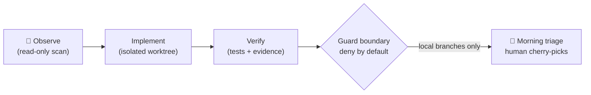

# alpha-nightshift

<div align="center">

**🇺🇸 English** ｜ [🇯🇵 日本語](README.ja.md) ｜ [🇨🇳 简体中文](README.zh.md) ｜ [🇹🇭 ไทย](README.th.md)


<h4>A nightly maintenance loop that lets an AI agent work on your repository overnight — locked inside a boundary that cannot push to the real remote.</h4>

[](https://github.com/caty-ai/alpha-nightshift/actions/workflows/ci.yml)
[](LICENSE)

%20%7C%20Linux%20(CI)-lightgrey)

[What it does](#what) ｜ [What you need](#requirements) ｜ [Getting started](#start) ｜ [Why it's safe](#safety) ｜ [Learn more](#more)

While you sleep, observation and repair lanes run in isolated worktrees.<br>
In the morning, you review a short report and pick only what proved itself.

**The night works. You decide.**

🔧 [Engineering documentation](docs/engineering.md) ｜ 📘 [Full reference](docs/reference.md)

</div>

---

<a id="familiar"></a>

## Sound familiar?

If one of these rings true, this loop was built for the same pain.

- Your AI agent only makes progress while you are at the keyboard — nights are dead time
- You tried leaving an agent running unattended once, and spent the whole evening worrying about what it might push
- Small maintenance chores (flaky tests, lint debt, doc drift) pile up because daytime is for feature work
- You want "autonomous," but every tool that promises it asks you to just trust it

alpha-nightshift is the night shift for that backlog — run under lock, not under trust.

---

<a id="what"></a>

## What it does

At night, the loop observes your repository, works on small maintenance lanes, and verifies its own results — all inside isolated git worktrees that never touch your main branch. In the morning, it hands you a triage report and you cherry-pick what earned its place.



- 🌙 **Works while you sleep**

  Scheduled lanes (via launchd) observe, implement, and verify in git worktrees — one lane, one branch, never on main.

- 🔒 **Cannot push to your real remote**

  The publisher sits behind a typed gateway whose preflight always answers `write_mode:false` until remote-safety proofs exist. Denial is the default state, not a config option.

- 🔍 **Scans everything it produces**

  A pinned `gitleaks` binary (hash-verified on every run) inspects candidate objects; binaries, archives, and unknown file shapes are denied outright.

- 🌅 **Reports to you every morning**

  A triage template turns the night's findings into accept/reject decisions you can make over coffee.

---

<a id="requirements"></a>

## What you need

The loop itself runs on a Mac; the test suite that proves its behavior also runs on Linux.

| Aspect | Support |
|---|---|
| macOS (Apple Silicon) | ✅ primary target — sandbox profiles and launchd scheduling are macOS-native |
| Linux | ✅ test suite runs in CI (Ubuntu); portable suites verified on every pull request |
| Runtime | ✅ bash 3.2+ (macOS system bash), Python 3.9+ for the publication gate, `jq` |
| AI agents | ✅ agent-agnostic — lanes drive any CLI agent you configure |

---

<a id="start"></a>

## Getting started

Two ways in — let your agent do it, or do it yourself.

### Ask your AI agent

Paste this into Claude Code, Codex CLI, or any coding agent:

```
Clone https://github.com/caty-ai/alpha-nightshift and run `make test`.
Then read docs/engineering.md and tell me how the guard boundary works.
```

### Do it yourself

```sh
git clone https://github.com/caty-ai/alpha-nightshift.git
cd alpha-nightshift
make test
```

`make test` checks the discovered suite count against `tests/expected_suite_count`, runs every suite whose environment contracts are present, and ends with a reconciliation line — `suites: declared=N executed=M skipped=K`. A suite that silently vanished fails the census check instead of hiding, and a suite whose contract is absent on your machine (for example, macOS `sandbox-exec` on Linux) is skipped with a printed reason, never silently.

<details>
<summary>If <code>make test</code> reports missing tools</summary>

- `jq` — `brew install jq` (macOS) / `apt-get install jq` (Linux)
- `shellcheck` (for `make lint`) — `brew install shellcheck` / `apt-get install shellcheck`
- `python3` (3.9+) — the publication-gate suites run with it
- `node` — one metsuke suite uses it
- The guard-scan suites need the pinned gitleaks binary at its contract path; when it is absent the runner skips them with a printed `SKIP <suite>: missing contract pinned_gitleaks` line.

</details>

---

<a id="safety"></a>

## Why it's safe to leave running

The design assumes the night worker will eventually misbehave — and makes the damage structurally impossible, not just unlikely.

- **Deny by default** — every remote-write decision starts at "no"; only explicit, test-proven allowances open, and unprovable cases stay denied (`UNSUPPORTED` is a hard disable, not a warning)
- **Isolated workspaces** — night lanes live in disposable git worktrees on their own branches; your main branch is never the workbench
- **Proof over promise** — the test suite pins the guard's behavior, and CI re-proves it on every pull request: the portable subset on Ubuntu, and the full-contract run on a hosted macOS runner that installs every pinned tool contract and fails if even one suite skips; the same full contract re-runs on a self-hosted macOS runner after merge
- **Honest limits** — capabilities that lack live-credential proof are labeled unproven in this README and in the design records, not marketed as done

The same honesty applies to the loop's output: findings without evidence do not survive morning triage.

---

<a id="more"></a>

## Learn more

Three doors, by depth.

| Document | For whom | What's inside |
|---|---|---|
| [docs/engineering.md](docs/engineering.md) | engineers | Architecture, module map, guard boundary, CI lanes |
| [docs/reference.md](docs/reference.md) | implementers / operators | Guard interface, mode vocabulary, publisher policy, test contracts |
| [DESIGN.md](DESIGN.md) | the curious | The original design document (its seat-review records are internal and are not part of this repository at all) |

---

## Development status

What is proven, and what is not yet.

- **Running today** — Phase 0 observation loop, isolated night lanes, morning triage, the local guard package (typed gateway, hard-disable preflight, pinned-gitleaks scanner, rendered sandbox measurement profile), and a read-only remote drift monitor
- **Not yet proven** — Phase 1b/1c remote publishing on live credentials: the publisher stays `LOCAL_ONLY_REMOTE_UNPROVEN` and preflight reports `write_mode:false` until protection readback and revocation proofs succeed on a real installation
- Progress and gate decisions are tracked in the repository's issues; publication of this repo itself ran on the [family-dev-handbook publication checklist](https://github.com/caty-ai/family-dev-handbook/issues/100)

---

## License

MIT — we want you to read this design, take it apart, and reuse it in your own night loops without asking permission. See [LICENSE](LICENSE).

<div align="center">

**bash + git worktrees** ｜ **agent-agnostic** ｜ **deny by default**

</div>
