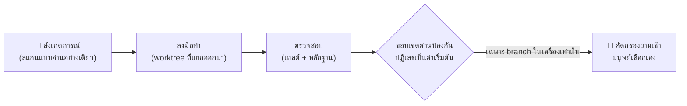

# alpha-nightshift

<div align="center">

[🇺🇸 English](README.md) ｜ [🇯🇵 日本語](README.ja.md) ｜ [🇨🇳 简体中文](README.zh.md) ｜ **🇹🇭 ไทย**


<h4>ลูปการดูแลรักษาทุกคืนที่ให้ AI agent ทำงานกับ repository ของคุณข้ามคืน — ถูกล็อกไว้ในขอบเขตที่ไม่สามารถ push ไปยัง remote จริงได้</h4>

[](https://github.com/caty-ai/alpha-nightshift/actions/workflows/ci.yml)
[](LICENSE)

%20%7C%20Linux%20(CI)-lightgrey)

[มันทำอะไร](#what) ｜ [สิ่งที่คุณต้องมี](#requirements) ｜ [เริ่มต้นใช้งาน](#start) ｜ [ทำไมมันจึงปลอดภัย](#safety) ｜ [เรียนรู้เพิ่มเติม](#more)

ขณะที่คุณหลับ เลนการสังเกตการณ์และการซ่อมแซมจะทำงานอยู่ใน worktree ที่แยกออกจากกัน<br>
พอถึงตอนเช้า คุณจะได้อ่านรายงานสั้นๆ แล้วเลือกเอาเฉพาะสิ่งที่พิสูจน์ตัวเองแล้ว

**กลางคืนทำงาน คุณเป็นคนตัดสินใจ**

🔧 [เอกสารทางวิศวกรรม](docs/engineering.md) ｜ 📘 [เอกสารอ้างอิงฉบับเต็ม](docs/reference.md)

</div>
<!-- repo-state:begin (generated; do not edit) -->
<p align="center"><sub>generation: <code>c37da39</code> (2026-08-26T19:54:02Z) · verify: <a href="https://api.github.com/repos/caty-ai/alpha-nightshift/commits/feat/repo-state-caller-5">API HEAD</a> · <a href="./status.json">status.json</a></sub></p>
<!-- repo-state:end -->

---

<a id="familiar"></a>

## รู้สึกคุ้นเคยไหม?

ถ้าข้อไหนข้อหนึ่งต่อไปนี้ตรงใจคุณ ลูปนี้ถูกสร้างขึ้นมาเพื่อความเจ็บปวดแบบเดียวกัน

- AI agent ของคุณคืบหน้าได้ก็ต่อเมื่อคุณนั่งอยู่หน้าคีย์บอร์ดเท่านั้น — กลางคืนกลายเป็นเวลาที่ตายเปล่า
- คุณเคยลองปล่อยให้ agent ทำงานโดยไม่มีคนดูแลมาแล้วครั้งหนึ่ง แล้วต้องใช้ทั้งคืนนั้นกังวลว่ามันจะ push อะไรออกไปบ้าง
- งานดูแลรักษาเล็กๆ น้อยๆ (เทสต์ที่ไม่เสถียร หนี้ด้าน lint เอกสารที่ตกยุค) พอกพูนขึ้นเรื่อยๆ เพราะเวลากลางวันต้องใช้ทำฟีเจอร์
- คุณอยากได้ความ "อัตโนมัติ" แต่เครื่องมือทุกตัวที่สัญญาสิ่งนี้ก็ขอแค่ให้คุณเชื่อใจมันเฉยๆ

alpha-nightshift คือกะกลางคืนสำหรับงานค้างเหล่านั้น — ทำงานภายใต้การล็อก ไม่ใช่ภายใต้ความไว้ใจ

---

<a id="what"></a>

## มันทำอะไร

ในเวลากลางคืน ลูปนี้จะสังเกตการณ์ repository ของคุณ ทำงานบนเลนดูแลรักษาเล็กๆ และตรวจสอบผลลัพธ์ของตัวเอง — ทั้งหมดนี้อยู่ภายใน git worktree ที่แยกออกจากกันซึ่งไม่แตะต้อง branch หลักของคุณเลย พอถึงตอนเช้า มันจะส่งรายงานคัดกรองให้คุณ แล้วคุณเลือกเก็บเฉพาะสิ่งที่คู่ควร



- 🌙 **ทำงานขณะที่คุณหลับ**

  เลนที่ถูกกำหนดเวลาไว้ (ผ่าน launchd) จะสังเกตการณ์ ลงมือทำ และตรวจสอบใน git worktree — หนึ่งเลน หนึ่ง branch ไม่มีทางแตะ main

- 🔒 **ไม่สามารถ push ไปยัง remote จริงของคุณได้**

  ตัว publisher อยู่หลัง gateway แบบ typed ที่การตรวจสอบก่อนทำงาน (preflight) จะตอบ `write_mode:false` เสมอ จนกว่าจะมีหลักฐานความปลอดภัยของ remote ยืนยัน การปฏิเสธคือสถานะเริ่มต้น ไม่ใช่ตัวเลือกในการตั้งค่า

- 🔍 **สแกนทุกอย่างที่มันสร้างขึ้น**

  ไบนารี `gitleaks` ที่ถูกตรึงเวอร์ชันไว้ (ตรวจสอบ hash ทุกครั้งที่รัน) จะตรวจสอบวัตถุที่เป็นตัวเลือก ไฟล์ไบนารี ไฟล์อาร์ไคฟ์ และรูปแบบไฟล์ที่ไม่รู้จักจะถูกปฏิเสธทันที

- 🌅 **รายงานให้คุณทุกเช้า**

  เทมเพลตการคัดกรองจะแปลงผลลัพธ์ของคืนนั้นให้กลายเป็นการตัดสินใจรับหรือปฏิเสธที่คุณทำได้ระหว่างจิบกาแฟ

- 🧭 **รักษาความสอดคล้องของ repository สาธารณะ**

  เลน org-consistency แบบอ่านอย่างเดียวจะตรวจหาความคลาดเคลื่อนระหว่างแผนที่ของกลุ่ม, README สาธารณะ และคำแนะนำสำหรับ agent โดยปล่อยให้การตัดสินใจทั้งหมดเป็นหน้าที่ของมนุษย์ในช่วงกลางวัน

---

<a id="requirements"></a>

## สิ่งที่คุณต้องมี

ตัวลูปเองรันบน Mac ส่วนชุดเทสต์ที่พิสูจน์พฤติกรรมของมันก็รันบน Linux ได้เช่นกัน

| ด้าน | รองรับ |
|---|---|
| macOS (Apple Silicon) | ✅ เป้าหมายหลัก — sandbox profile และการจัดตารางเวลาผ่าน launchd เป็นของ macOS โดยเฉพาะ |
| Linux | ✅ ชุดเทสต์รันใน CI (Ubuntu) ชุดเทสต์ที่พกพาได้ถูกตรวจสอบในทุก pull request |
| Runtime | ✅ bash 3.2+ (bash ของระบบ macOS), Python 3.9+ สำหรับด่านการเผยแพร่ (publication gate), `jq` |
| AI agents | ✅ ไม่ผูกกับ agent ตัวใดตัวหนึ่ง — เลนต่างๆ ขับเคลื่อน CLI agent อะไรก็ได้ที่คุณตั้งค่าไว้ |

---

<a id="start"></a>

## เริ่มต้นใช้งาน

มีสองทาง — ให้ agent ของคุณทำให้ หรือทำเองก็ได้

### ให้ AI agent ของคุณช่วย

วางข้อความนี้ลงใน Claude Code, Codex CLI หรือ coding agent ตัวไหนก็ได้

```
Clone https://github.com/caty-ai/alpha-nightshift and run `make test`.
Then read docs/engineering.md and tell me how the guard boundary works.
```

### ทำเอง

```sh
git clone https://github.com/caty-ai/alpha-nightshift.git
cd alpha-nightshift
make test
```

`make test` จะตรวจสอบจำนวนชุดเทสต์ที่พบเทียบกับ `tests/expected_suite_count` รันทุกชุดเทสต์ที่มีสภาพแวดล้อมตามสัญญาครบถ้วน และจบด้วยบรรทัดสรุปยืนยัน — `suites: declared=N executed=M skipped=K` ชุดเทสต์ที่หายไปเงียบๆ จะทำให้การตรวจสอบจำนวนนี้ล้มเหลวแทนที่จะซ่อนตัวไป ส่วนชุดเทสต์ที่สภาพแวดล้อมตามสัญญาไม่มีอยู่ในเครื่องของคุณ (เช่น `sandbox-exec` ของ macOS บน Linux) จะถูกข้ามไปพร้อมพิมพ์เหตุผลออกมา ไม่มีการข้ามแบบเงียบๆ

<details>
<summary>ถ้า <code>make test</code> รายงานว่าขาดเครื่องมือ</summary>

- `jq` — `brew install jq` (macOS) / `apt-get install jq` (Linux)
- `shellcheck` (สำหรับ `make lint`) — `brew install shellcheck` / `apt-get install shellcheck`
- `python3` (3.9 ขึ้นไป) — ชุดเทสต์ publication-gate ต้องใช้ตัวนี้ในการรัน
- `node` — ชุดเทสต์ metsuke หนึ่งชุดใช้ตัวนี้
- ชุดเทสต์ guard-scan ต้องการไบนารี gitleaks ที่ถูกตรึงเวอร์ชันไว้ที่ path ตามสัญญา ถ้าไม่พบ ตัวรัน (runner) จะข้ามชุดเทสต์เหล่านั้นพร้อมพิมพ์บรรทัด `SKIP <suite>: missing contract pinned_gitleaks` ออกมา

</details>

---

<a id="safety"></a>

## ทำไมมันจึงปลอดภัยที่จะปล่อยให้ทำงาน

การออกแบบนี้ตั้งอยู่บนสมมติฐานว่าตัวทำงานยามค่ำคืนจะประพฤติตัวไม่ดีในสักวันหนึ่ง — และทำให้ความเสียหายนั้นเป็นไปไม่ได้โดยโครงสร้าง ไม่ใช่แค่ไม่น่าจะเกิดขึ้น

- **ปฏิเสธเป็นค่าเริ่มต้น** — การตัดสินใจเขียนไปยัง remote ทุกครั้งเริ่มต้นที่ "ไม่" มีเพียงข้อยกเว้นที่ชัดเจนและพิสูจน์ด้วยเทสต์แล้วเท่านั้นที่จะเปิดได้ และกรณีที่พิสูจน์ไม่ได้จะยังคงถูกปฏิเสธต่อไป (`UNSUPPORTED` คือการปิดใช้งานถาวร ไม่ใช่แค่คำเตือน)
- **พื้นที่ทำงานที่แยกออกจากกัน** — เลนยามค่ำคืนอาศัยอยู่ใน git worktree ที่ใช้แล้วทิ้งได้บน branch ของตัวเอง branch หลักของคุณไม่เคยเป็นโต๊ะทำงานเลย
- **หลักฐานสำคัญกว่าคำสัญญา** — ชุดเทสต์ตรึงพฤติกรรมของด่านป้องกันไว้ และ CI พิสูจน์ซ้ำทุกครั้งในทุก pull request: รันชุดย่อยที่พกพาได้ (portable subset) บน Ubuntu และรันแบบครบตามสัญญาทั้งหมดบน macOS runner แบบ hosted ที่ติดตั้งเครื่องมือทุกตัวตามสัญญาที่ตรึงเวอร์ชันไว้ ซึ่งจะล้มเหลวทันทีถ้ามีชุดเทสต์แม้แต่ชุดเดียวถูกข้าม; หลังจาก merge แล้ว สัญญาชุดเดียวกันจะถูกรันซ้ำทุกครั้งที่ push ไปยัง main
- **ขีดจำกัดที่ซื่อสัตย์** — ความสามารถที่ยังขาดหลักฐานจากการใช้ credential จริงจะถูกระบุว่ายังพิสูจน์ไม่ได้ ทั้งใน README นี้และในบันทึกการออกแบบ ไม่มีการโฆษณาว่าเสร็จสมบูรณ์แล้ว

ความซื่อสัตย์แบบเดียวกันนี้ก็ใช้กับผลลัพธ์ของลูปด้วย — สิ่งที่ตรวจพบโดยไม่มีหลักฐานจะไม่รอดพ้นการคัดกรองยามเช้าไปได้

---

<a id="more"></a>

## เรียนรู้เพิ่มเติม

สามประตู ตามระดับความลึก

| เอกสาร | เหมาะสำหรับใคร | มีอะไรอยู่ข้างใน |
|---|---|---|
| [docs/engineering.md](docs/engineering.md) | วิศวกร | สถาปัตยกรรม แผนผังโมดูล ขอบเขตด่านป้องกัน เลน CI |
| [docs/reference.md](docs/reference.md) | ผู้พัฒนา / ผู้ดูแลระบบ | อินเทอร์เฟซของด่านป้องกัน คำศัพท์ของโหมดต่างๆ นโยบายของ publisher สัญญาของเทสต์ |
| [DESIGN.md](DESIGN.md) | ผู้ที่อยากรู้อยากเห็น | เอกสารการออกแบบต้นฉบับ (บันทึกการรีวิวแบบ seat-review เป็นเอกสารภายใน และไม่ได้รวมอยู่ใน repository นี้) |

รีโพนี้คือชุดปฏิบัติการทั้งระบบ ไม่ใช่แพ็กเกจสำหรับติดตั้ง (ไม่มีการเผยแพร่ทาง npm/pip และไม่มีแผน) หากต้องการนำชิ้นส่วนไปใช้อ้างอิง ให้ clone รีโพแล้วอ่านส่วนที่ต้องการ: กลไก verdict ของ morning-triage (`bin/morning-triage`) ชุดทดสอบ publication gate (`tests/`) และแพ็กเกจ guard (`guard/`) เหมาะที่สุดสำหรับใช้เป็นวัสดุอ้างอิง

<!-- family:generated:family-footer:start -->

---

รีโพนี้เป็นส่วนหนึ่งของ **ครอบครัว Caty AI** — ชุดเครื่องมือโอเพนซอร์สสำหรับดูแลครอบครัวเอเจนต์ AI แผนที่ฉบับเต็ม (รวมโมดูลที่กำลังเตรียมเปิด) อยู่ที่ [Family OS](https://github.com/caty-ai/family-os)

| แกน | โมดูล | ทำอะไร | สถานะ |
| --- | --- | --- | --- |
| แผนที่ | [Family OS](https://github.com/caty-ai/family-os) | แผนที่ของทั้งครอบครัว — โมดูล สถานะ และโครงสร้าง | เปิดแล้ว・MIT |
| กติกา | [Family Dev Handbook](https://github.com/caty-ai/family-dev-handbook) | กติกากลางของการพัฒนา — Issue, PR, worktree, การส่งงานต่อ และการทำงานคู่ขนาน | เปิดแล้ว・MIT |
| แกนตั้ง · รากฐาน | [Caty Agent Harness](https://github.com/caty-ai/caty-agent-harness) | แกนงานของเอเจนต์ AI — การลองใหม่ เช็คพอยต์ และการตัดสินว่าเสร็จจริง | เปิดแล้ว・MIT |
| แกนตั้ง | [context-kit](https://github.com/caty-ai/context-kit) | ชุดดูแลคอนเท็กซ์ 6 ชิ้นสำหรับเอเจนต์หนึ่งตัว — จำกัดเอาต์พุตขนาดใหญ่, ตรวจ brief การมอบงาน, การ์ดความปลอดภัย, ค้นความทรงจำ, snapshot ของ worktree | เปิดแล้ว・MIT |
| แกนตั้ง | [Persona Engine](https://github.com/caty-ai/persona-engine) | มอบบุคลิกให้เอเจนต์ — เลเยอร์บุคลิกและอารมณ์แบบไล่ระดับ | เปิดแล้ว・MIT |
| แกนตั้ง | [Persona Growth Loop](https://github.com/caty-ai/persona-growth-loop) | พัฒนาบุคลิกของเอเจนต์ — สร้างข้อเสนอแบบน้อยที่สุดและทำซ้ำได้ | เปิดแล้ว・MIT |
| แกนตั้ง | [X Collector](https://github.com/caty-ai/x-collector) | รวบรวมข้อมูลจาก X และเว็บเป็นสรุปวันละฉบับ — สำหรับคนและเอเจนต์ | เปิดแล้ว・MIT |
| แกนตั้ง | [Self Growth Loop](https://github.com/caty-ai/self-growth-loop) | วงจรให้เอเจนต์พัฒนาความสามารถของตัวเอง — ข้อเสนอ ธรรมาภิบาล และบันทึกการนำไปใช้ | เปิดแล้ว・MIT |
| แกนนอน · รากฐาน | [Family Memory Architecture](https://github.com/caty-ai/family-memory-architecture) | บัสความทรงจำ — ชั้นที่ครอบครัวใช้แบ่งปันสิ่งที่รู้ | เปิดแล้ว・MIT |
| แกนนอน | [Sitter](https://github.com/caty-ai/sitter) | พี่เลี้ยงของงานที่มอบหมายให้เอเจนต์ — เฝ้าดู เก็บหลักฐาน และรีสตาร์ตเฉพาะในขอบเขตที่ประกาศไว้ | เปิดแล้ว・MIT |
| แกนนอน | **Alpha Nightshift** | ลูปบำรุงรักษาอัตโนมัติยามค่ำคืน — เลนกลางคืนทำงานหลังการ์ดแบบปฏิเสธโดยปริยาย ตอนเช้ามนุษย์เลือก cherry-pick | เปิดแล้ว・MIT |

<!-- family:generated:family-footer:end -->

---

## สถานะการพัฒนา

สิ่งที่พิสูจน์แล้ว และสิ่งที่ยังไม่ได้พิสูจน์

- **ทำงานได้แล้ววันนี้** — ลูปสังเกตการณ์ระยะ Phase 0, เลนยามค่ำคืนที่แยกออกจากกัน, การคัดกรองยามเช้า, ชุดด่านป้องกันในเครื่อง (typed gateway, preflight แบบปิดใช้งานถาวร, ตัวสแกน gitleaks ที่ตรึงเวอร์ชันไว้, sandbox measurement profile ที่ถูก render แล้ว) และตัวติดตาม remote drift แบบอ่านอย่างเดียว
- **ยังไม่ได้พิสูจน์** — การเผยแพร่ไปยัง remote ในระยะ Phase 1b/1c ด้วย credential จริง: ตัว publisher ยังคงอยู่ในสถานะ `LOCAL_ONLY_REMOTE_UNPROVEN` และ preflight รายงาน `write_mode:false` จนกว่าการอ่านกลับของการป้องกัน (protection readback) และหลักฐานการเพิกถอนจะสำเร็จบนการติดตั้งจริง
- ความคืบหน้าและการตัดสินใจในแต่ละด่านถูกติดตามไว้ใน issues ของ repository นี้ การเผยแพร่ repo นี้เองก็ดำเนินไปตาม [family-dev-handbook publication checklist](https://github.com/caty-ai/family-dev-handbook/issues/100)

---

## สัญญาอนุญาต

MIT — เราอยากให้คุณอ่านการออกแบบนี้ แกะมันออกมาดู และนำไปใช้ใหม่ในลูปยามค่ำคืนของคุณเองได้โดยไม่ต้องขออนุญาต ดู [LICENSE](LICENSE)

<div align="center">

**bash + git worktrees** ｜ **ไม่ผูกกับ agent ตัวใดตัวหนึ่ง** ｜ **ปฏิเสธเป็นค่าเริ่มต้น**

</div>
