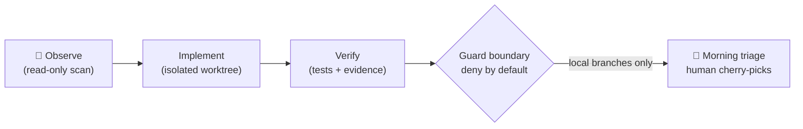

# alpha-nightshift

<div align="center">

[🇺🇸 English](README.md) ｜ [🇯🇵 日本語](README.ja.md) ｜ **🇨🇳 简体中文** ｜ [🇹🇭 ไทย](README.th.md)


<h4>一个夜间维护循环（loop），让 AI 智能体（agent）在你睡觉时处理你的代码仓库——被锁在一个无法推送（push）到真实远程仓库（remote）的边界之内。</h4>

[](https://github.com/caty-ai/alpha-nightshift/actions/workflows/ci.yml)
[](LICENSE)

%20%7C%20Linux%20(CI)-lightgrey)

[它是做什么的](#what) ｜ [你需要什么](#requirements) ｜ [快速开始](#start) ｜ [为什么安全](#safety) ｜ [了解更多](#more)

当你睡觉的时候，观察（observation）和修复（repair）两条通道（lane）在各自隔离的工作树（worktree）里运行。<br>
到了早上，你只需查看一份简短的报告，挑选那些已经证明自己有效的成果。

**夜里干活，你来决定。**

🔧 [工程文档](docs/engineering.md) ｜ 📘 [完整参考文档](docs/reference.md)

</div>
<!-- repo-state:begin (generated; do not edit) -->
<p align="center"><sub>generation: <code>f87b3af</code> (2026-08-29T03:42:41Z) · verify: <a href="https://api.github.com/repos/caty-ai/alpha-nightshift/commits/main">API HEAD</a> · <a href="./status.json">status.json</a></sub></p>
<!-- repo-state:end -->

---

<a id="familiar"></a>

## 这些情况你是不是也遇到过？

如果下面任何一条说中了你，这个循环就是为同样的痛点而生的。

- 你的 AI 智能体只有在你坐在电脑前时才能推进工作——夜晚完全被浪费掉了
- 你曾经试过让智能体无人看管地跑一整晚，结果一整个晚上都在担心它会推送出什么东西
- 琐碎的维护工作（不稳定的测试、代码风格（lint）债务、文档漂移）不断堆积，因为白天要用来做功能开发
- 你想要“自主运行（autonomous）”，但每个承诺自主的工具都要求你先无条件信任它

alpha-nightshift 就是为处理这些积压任务而生的夜班——靠锁（lock）来约束，而不是靠信任。

---

<a id="what"></a>

## 它是做什么的

在夜里，这个循环会观察你的代码仓库，在小规模的维护通道（lane）上工作，并自行验证结果——所有这些都在与主分支（main branch）完全隔离的 git 工作树（worktree）中进行，绝不会碰到你的主分支。到了早上，它会给你一份分类整理报告（triage report），由你来挑选哪些成果值得采纳。



- 🌙 **在你睡觉时工作**

  通过 launchd 调度的通道（lane）会在 git 工作树（worktree）中完成观察、实现（implement）与验证——一个通道对应一个分支（branch），绝不会用到主分支。

- 🔒 **无法推送到你的真实远程仓库**

  发布器（publisher）位于一个类型化网关（typed gateway）之后，只要远程安全性（remote-safety）的证明尚未成立，它的预检（preflight）就始终返回 `write_mode:false`。拒绝是默认状态，而不是一个可配置的选项。

- 🔍 **扫描它产出的一切**

  一个经过版本锁定（pinned）、并在每次运行时进行哈希校验的 `gitleaks` 二进制文件会检查候选对象；二进制文件、压缩包以及未知形态的文件一律被拒绝。

- 🌅 **每天早上向你汇报**

  一个分类整理（triage）模板会把当晚的发现整理成你可以在喝咖啡时轻松做出的“接受/拒绝”决策。

- 🧭 **保持公开仓库之间的一致**

  只读的 org-consistency 通道会发现家族地图、公开 README 和智能体操作说明之间的偏差，并把所有后续决定留给白天的人工审查。

---

<a id="requirements"></a>

## 你需要什么

这个循环本身运行在 Mac 上；用来验证其行为的测试套件同样也能在 Linux 上运行。

| 方面 | 支持情况 |
|---|---|
| macOS（Apple Silicon） | ✅ 主要目标平台——沙盒（sandbox）配置文件与 launchd 调度是 macOS 原生特性 |
| Linux | ✅ 测试套件在 CI（Ubuntu）中运行；每次 pull request 都会验证可移植的测试套件 |
| 运行时（Runtime） | ✅ bash 3.2+（macOS 系统自带 bash）、用于发布门禁（publication gate）的 Python 3.9+、`jq` |
| AI 智能体（agent） | ✅ 与具体智能体无关（agent-agnostic）——各通道（lane）可以驱动你配置的任意命令行智能体 |

---

<a id="start"></a>

## 快速开始

两种方式——让你的智能体来做，或者自己动手。

### 让你的 AI 智能体来做

把下面这段话粘贴到 Claude Code、Codex CLI 或任意编码智能体中：

```
Clone https://github.com/caty-ai/alpha-nightshift and run `make test`.
Then read docs/engineering.md and tell me how the guard boundary works.
```

### 自己动手

```sh
git clone https://github.com/caty-ai/alpha-nightshift.git
cd alpha-nightshift
make test
```

`make test` 会将发现到的测试套件数量与 `tests/expected_suite_count` 进行核对，运行所有环境契约（environment contract）齐备的套件，并以一行核对信息（reconciliation line）结束——`suites: declared=N executed=M skipped=K`。如果某个套件悄悄消失了，它不会被隐藏，而是会让这项数量核对检查失败；那些在你机器上缺少环境契约的套件（例如在 Linux 上运行 macOS 专属的 `sandbox-exec`）会被跳过，并打印出跳过的原因，绝不会悄无声息地略过。

<details>
<summary>如果 <code>make test</code> 报告缺少工具</summary>

- `jq` — `brew install jq`（macOS）/ `apt-get install jq`（Linux）
- `shellcheck`（用于 `make lint`）— `brew install shellcheck` / `apt-get install shellcheck`
- `python3`（3.9 及以上）— 发布门禁（publication-gate）相关套件依赖它运行
- `node` — 有一个 metsuke 套件会用到它
- 守卫扫描（guard-scan）相关套件需要在契约路径（contract path）上有版本锁定（pinned）的 gitleaks 二进制文件；如果缺失，运行器（runner）会跳过这些套件，并打印出 `SKIP <suite>: missing contract pinned_gitleaks` 这一行。

</details>

---

<a id="safety"></a>

## 为什么可以放心让它无人看管地运行

这个设计假设夜间工作的智能体（night worker）迟早会出错——因此它要做到的是从结构上让损害变得不可能发生，而不仅仅是“不太可能”。

- **默认拒绝（Deny by default）**——每一个涉及远程写入（remote-write）的决策都从“不行”开始；只有经过测试证明的、明确授权的情况才会放行，无法证明的情况则始终保持拒绝状态（`UNSUPPORTED` 是硬性禁用，而不是一条警告）
- **隔离的工作空间**——夜间通道（lane）运行在一次性的 git 工作树（worktree）上，各自拥有独立分支；你的主分支绝不会成为工作台
- **用证据说话，而不是承诺**——测试套件把守卫（guard）的行为锁定下来，CI 会在每一次 pull request 中重新验证一遍：在 Ubuntu 上运行可移植的子集，并在托管（hosted）macOS 运行器上安装全部锁定版本的工具契约后执行完整运行——只要有一个套件被跳过，就会判定失败；合并之后，同样的完整契约会在每次推送到 main 时再跑一次
- **诚实地标注局限**——凡是缺少真实凭证（live-credential）证明的能力，都会在本 README 和设计记录中被明确标注为“尚未证实（unproven）”，而不是当作已完成的功能来宣传

同样的诚实态度也适用于这个循环产出的结果：没有证据支撑的发现，是不会通过早间分类整理（morning triage）的。

---

<a id="more"></a>

## 了解更多

三扇门，深度各不相同。

| 文档 | 面向谁 | 里面有什么 |
|---|---|---|
| [docs/engineering.md](docs/engineering.md) | 工程师 | 架构、模块地图、守卫边界（guard boundary）、CI 通道 |
| [docs/reference.md](docs/reference.md) | 实现者 / 运维人员 | 守卫接口、模式词汇表、发布器（publisher）策略、测试契约 |
| [DESIGN.md](DESIGN.md) | 好奇的人 | 原始设计文档（其中的评审席位记录属于内部资料，并未包含在本仓库中） |

本仓库是一整套运维体系，而不是可安装的软件包（没有 npm/pip 发布，也没有相关计划）。如需借鉴其中的部件，请 clone 仓库并阅读所需部分：morning-triage 的 verdict 机制（`bin/morning-triage`）、publication gate 测试套件（`tests/`）和 guard 包（`guard/`）最适合作为参考材料。

<!-- family:generated:family-footer:start -->

---

本仓库属于 **Caty AI 家族** — 用于运营 AI 智能体家族的开源工具集。完整地图（包括仍在准备公开的模块）见 [Family OS](https://github.com/caty-ai/family-os)。

| 轴 | 模块 | 做什么 | 状态 |
| --- | --- | --- | --- |
| 地图 | [Family OS](https://github.com/caty-ai/family-os) | 整个家族的地图 — 模块、状态与结构 | 已公开・MIT |
| 规则 | [Family Dev Handbook](https://github.com/caty-ai/family-dev-handbook) | 开发的交通规则 — Issue、PR、worktree、交接与并行开发 | 已公开・MIT |
| 纵轴・基座 | [Caty Agent Harness](https://github.com/caty-ai/caty-agent-harness) | AI 智能体的任务基座 — 重试、检查点与完成判定 | 已公开・MIT |
| 纵轴 | [context-kit](https://github.com/caty-ai/context-kit) | 面向单个智能体的六件上下文卫生工具组 — 限制大输出、委托简报校验、安全防护、记忆检索、worktree 快照 | 已公开・MIT |
| 纵轴 | [Persona Engine](https://github.com/caty-ai/persona-engine) | 为智能体赋予人格 — 分层人格与情感渐变 | 已公开・MIT |
| 纵轴 | [Persona Growth Loop](https://github.com/caty-ai/persona-growth-loop) | 让人格本身成长 — 以最小且幂等的提案 | 已公开・MIT |
| 纵轴 | [X Collector](https://github.com/caty-ai/x-collector) | 把 X 与网络素材汇成每日一份摘要 — 给人也给智能体 | 已公开・MIT |
| 纵轴 | [Self Growth Loop](https://github.com/caty-ai/self-growth-loop) | 让智能体自我成长的循环 — 提案、治理与采用记录 | 已公开・MIT |
| 横轴・基座 | [Family Memory Architecture](https://github.com/caty-ai/family-memory-architecture) | 记忆总线 — 家族共享所知的一层 | 已公开・MIT |
| 横轴 | [Sitter](https://github.com/caty-ai/sitter) | 替你盯着委派出去的智能体 — 监视、留证、仅在声明范围内重启 | 已公开・MIT |
| 横轴 | **Alpha Nightshift** | 夜间自主维护循环 — 在默认拒绝的防护边界内运行夜间通道，早晨由人工挑选合并 | 已公开・MIT |

<!-- family:generated:family-footer:end -->

---

## 开发状态

哪些已经得到验证，哪些还没有。

- **今天已经可用**——Phase 0 观察循环、隔离的夜间通道（lane）、早间分类整理（morning triage）、本地守卫包（typed gateway、硬性禁用预检、版本锁定的 gitleaks 扫描器、渲染出的沙盒测量配置文件），以及一个只读的远程漂移（drift）监控
- **尚未证实**——基于真实凭证（live credentials）的 Phase 1b/1c 远程发布：发布器（publisher）目前仍处于 `LOCAL_ONLY_REMOTE_UNPROVEN` 状态，预检（preflight）会持续报告 `write_mode:false`，直到在真实环境安装中成功完成保护回读（protection readback）与撤销（revocation）证明为止
- 进展与各阶段门禁决策会记录在本仓库的 issue 中；本仓库自身的发布工作是按照 [family-dev-handbook 发布检查清单](https://github.com/caty-ai/family-dev-handbook/issues/100) 完成的

---

## 许可证

MIT——我们希望你阅读这份设计、拆解它，并且无需征求许可就能把它用在你自己的夜间循环里。详见 [LICENSE](LICENSE)。

<div align="center">

**bash + git worktrees** ｜ **agent-agnostic** ｜ **deny by default**

</div>
